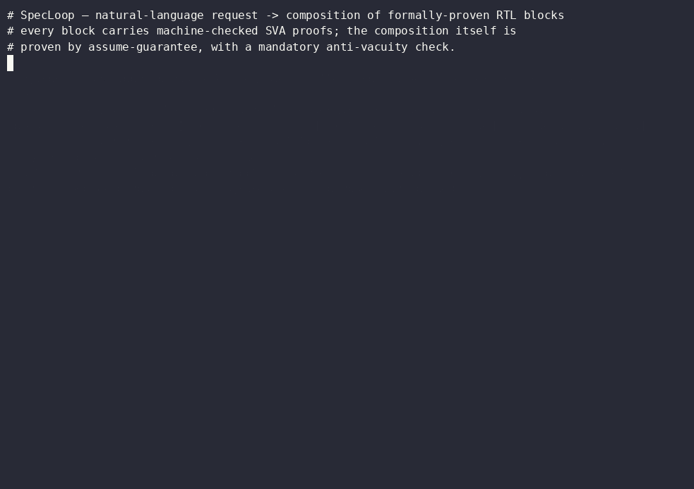
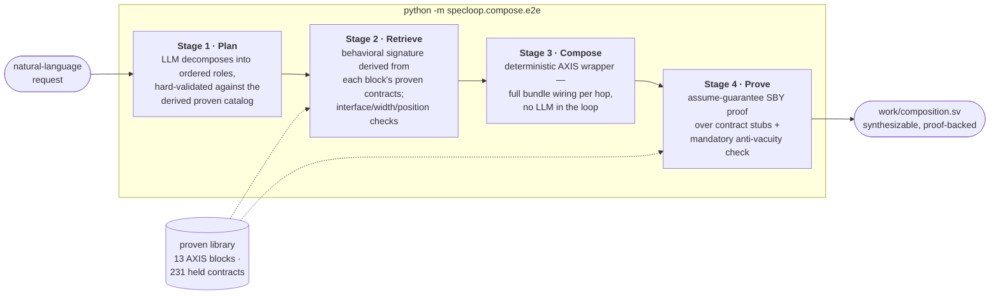

# SpecLoop


**AI-assisted compositional formal verification for RTL.** SpecLoop takes a natural-language hardware request, decomposes it into an ordered pipeline of roles, retrieves a formally-proven RTL block for each role from a library of machine-checked components, wires them into a synthesizable composition, and then proves the *composition itself* correct by assume-guarantee reasoning — with mandatory anti-vacuity checks at every step. The thesis: LLMs are good at proposing hardware and terrible at being trusted, so every artifact that survives the pipeline must carry a formal proof, and every proof must be demonstrated falsifiable before it counts.

> **Project status: closed.** SpecLoop reached its target technical milestone — a sound, end-to-end natural-language → proven-composition pipeline — and was then deliberately wound down for strategic reasons. See [POSTMORTEM.md](POSTMORTEM.md) for the honest write-up and [DESIGN.md](DESIGN.md) for the unimplemented design work.

## Demo


```text
$ python -m specloop.compose.e2e "register, buffer, normalize frame length, and rate-limit an 8-bit stream"
request : 'register, buffer, normalize frame length, and rate-limit an 8-bit stream'
roles   : register@8[head] -> buffer@8[middle] -> frame_adjust@8[middle] -> rate_limit@8[tail]
blocks  : axis_pipeline_register -> axis_fifo -> axis_frame_length_adjust -> axis_rate_limit
stage-3 : order_axis_pipeline accepted = True
proof   : PASS  (AG composition proof (back-pressure + reset)); anti-vacuity (corrupted ref) = FAIL
output  : work/composition.sv  (synthesizable composed top module)
```

Every line of that trace is load-bearing: the roles come from an LLM constrained to the proven catalog (out-of-vocabulary requests fail honestly at planning time — ask it to "encrypt with AES-256" and you get `cannot plan`, not hallucinated RTL); the blocks are matched by behavior *derived from their proven contracts*, not by name or embedding; the proof is an assume-guarantee composition proof; and `anti-vacuity = FAIL` means the same proof with a corrupted reference produces a counterexample — the PASS is demonstrably checking something.

### Quickstart

Linux x64, Python ≥ 3.11, ~6 GB disk (Python deps incl. torch, plus the OSS CAD Suite formal toolchain). An `ANTHROPIC_API_KEY` is needed only for the live demo's planning stage — the entire test suite, including all formal proofs, runs without any API key.

```bash
git clone https://github.com/hrisheekmust-blip/SPECLOOP.git specloop && cd specloop
bash scripts/setup.sh        # venv + deps, corpus submodule, pinned yosys/sby, runs all test suites
source .venv/bin/activate
export PATH="$PWD/oss-cad-suite/bin:$PATH"
export ANTHROPIC_API_KEY=...
python -m specloop.compose.e2e "register, buffer, normalize frame length, and rate-limit an 8-bit stream"
```

The setup script pins the formal toolchain to **OSS CAD Suite 2025-01-14 (Yosys 0.48+77, git eac2294ca)**; the exact Python dependency versions the demo was last verified against are in `requirements.lock.txt`. The pin is not cosmetic — this project's central lesson is that front-end behavior differences between Yosys builds are semantic (see below), and the test suite re-verifies the toolchain's behavior on every run.

## The soundness story (read this first)

This is the part of the project we are proudest of, and it started with discovering that **every proof we had was worthless.**

SpecLoop's original architecture was conventional: for each RTL module, an LLM generates a SystemVerilog Assertions spec; the spec lives in a separate module attached to the design with a SystemVerilog `bind` statement; SymbiYosys (sby) + Yosys prove it; failures go through a counterexample-guided repair loop. This produced a library of dozens of "proven" modules with high confidence scores, and a composition layer that carried those proofs into assembled pipelines — at its peak, a four-stage AXI-Stream pipeline reporting **95 carried + 14 interaction assertions, PASS, confidence 1.0, in about a second.**

That last number should have been the tell. Nothing real proves that fast.

While hardening the composition proof, we ran the one experiment that mattered: attach `assert(1'b0)` — *false, unconditionally* — to a module via `bind`, and run sby. **It passed.** Inline the same assertion into the module body: **it failed instantly.** The open-source Yosys `read_verilog` front end used by sby parses `bind` statements without a single warning and then silently never instantiates the bound module. Zero assertion cells reach the netlist. sby dutifully proves the empty property set and reports PASS. Every bind-attached proof we had ever run — the entire module library, the entire composition spine — had been checking nothing.

Two adjacent landmines surfaced in the same audit:

- **Zero-assertion runs reported `pass@1.00`.** If sanitization or generation produced a spec with no surviving assertions, the backend counted it as a perfect proof. Fixed to report `unknown@0.00`.
- **synlig** (the SystemVerilog front end that *does* honor `bind` — `assert(1'b0)` correctly fails under it) hit internal errors on the composition RTL, so it could not simply replace the front end. It was reverted, and the two-pass architecture documented for the future.

### The rebuild

The entire library was re-proven from scratch under a harness designed so that a vacuous pass is structurally impossible (`work/recheck_axis/harness.py`):

- **Inline, never bind.** The spec body is injected *into a copy of the module source* — not bound, not wired through ports — so internal-signal assertions resolve and the assertions provably reach the netlist.
- **Driven reset sequencing.** A free-running counter drives the reset assumption (`rst` asserted for the first 3 cycles, then released forever), so `$past` is well-defined after release and reset behavior is actually exercised rather than assumed away.
- **AXIS source assumptions.** The slave input is driven by a well-behaved AXI-Stream master per the AMBA spec: TVALID low during reset; once TVALID asserts, it holds until TREADY, with payload stable while stalled. Master-side outputs are left free.
- **Three mandatory anti-vacuity gates.** Nothing is recorded as proven unless *all three* pass:
  1. **`assume_sat`** — with the environment active, `assert(1'b0)` must **FAIL**. If it passes, the assumptions are self-contradictory and everything downstream is vacuous.
  2. **`cover`** — a normal accepted beat (`tvalid && tready` out of reset) must be **reachable**. If not, the environment is over-constrained and proofs are about an empty world.
  3. **`assert_chk`** — corrupting one stored assertion must **FAIL**. If it doesn't, the assertions aren't in the cone of the proof at all (this is the gate that catches the `bind` bug class).

The gated re-proof processed **267 LLM-generated assertions across 13 single-clock AXI-Stream modules**:

- **231 genuinely hold** (185 exercised and k-induction-proven, 28 guard-dormant, 18 hold in BMC but are non-inductive),
- **32 were genuinely wrong** — real counterexamples under a sound environment, on modules that are themselves correct. They had all survived the vacuous era as "proven." The discard list (`work/recheck_axis/DISCARD_LIST.md`) reads like a catalog of plausible-sounding LLM spec bugs: inverted skid-buffer semantics, reset-polarity flips, config-dependent claims stated unconditionally, over-strict FSM/pointer invariants, FIFO full/empty invariants that ignore simultaneous read+write,
- **4 were re-categorized** — true properties mis-stated as assertions when they are control-input assumptions.

The bind behavior itself is now a locked-in regression test (`test_sby_checks_inlined_not_bind`): every test run re-verifies that the installed toolchain checks inlined assertions and ignores bound ones, and the CLI prints **NOT VERIFIED** on any path that still attaches properties via `bind`. The standing rule from this episode is written into the project's working practice: **no PASS is believed until the same harness has produced a FAIL** — `assert(1'b0)` first, then the real property.

## What is proven today

Exact claims only; everything below is reproducible from this repo with `scripts/setup.sh`.

**1. A library of 13 soundly-reproven single-clock AXI-Stream modules** (RTL from [alexforencich/verilog-axis](https://github.com/alexforencich/verilog-axis), proofs in `work/*.bind.sv` + `work/recheck_axis/`):

| module | held / total assertions | sound confidence |
|---|---|---|
| axis_pipeline_register | 16/16 | 1.00 |
| axis_srl_register | 13/13 | 1.00 |
| axis_register | 24/25 | 0.96 |
| axis_fifo (DEPTH=256) | 24/25 | 0.96 |
| axis_frame_join | 18/19 | 0.95 |
| axis_adapter | 10/11 | 0.91 |
| axis_cobs_decode | 23/26 | 0.88 |
| axis_cobs_encode | 17/20 | 0.85 |
| axis_rate_limit | 29/35 | 0.83 |
| axis_mux | 12/15 | 0.80 |
| axis_srl_fifo | 14/19 | 0.74 |
| axis_frame_length_adjust | 14/19 | 0.74 |
| axis_demux | 17/24 | 0.71 |

Two further AXIS modules were honestly flagged out rather than force-fitted: `axis_async_fifo` (dual-clock — needs a CDC environment) and `axis_ll_bridge` (malformed generated spec that cannot elaborate).

**2. Chain A — assume-guarantee composition proof.** For `axis_pipeline_register → axis_fifo → axis_frame_length_adjust → axis_rate_limit`, seven cross-boundary properties are proven (`work/recheck_axis/ag/chainA_ag_closed.sv`): reset cleanliness of the composition's output-valid and input-ready, back-pressure data stability across all four boundaries, and output valid-held under stall. The proof is over *contract stubs* — each block replaced by free (`anyseq`) outputs constrained only by that block's own proven, cited guarantees — so it scales independently of block internals. Five of seven followed from existing contracts; two exposed genuine contract gaps that were closed by proving the missing properties inline first. Anti-vacuity: corrupting the reference assertion flips the verdict to FAIL.

**3. Chain B — end-to-end data-integrity proof.** For `axis_cobs_encode → axis_register → axis_cobs_decode`, a closed BMC harness injects one symbolic frame (`anyconst` data, symbolic length ≤ N) and asserts byte-exact round-trip delivery with a completeness deadline. **Proven for all frames up to 8 bytes** (bounded — this is BMC, stated as such). Corrupting the reference yields a counterexample.

**4. A stable four-stage e2e pipeline** (`python -m specloop.compose.e2e`): plan → retrieve → compose → prove, with honest failure at every stage (out-of-vocabulary function, unavailable width, no proven block, no proof artifact) instead of silent substitution. Retrieval matching is *derived from each block's proven contracts* — there is no hand-assigned function label in the loop, and the test suite proves it by scrambling stored labels and observing no change.

Known limits, stated plainly: the assume-guarantee harness exists for Chain A specifically (novel chains plan, retrieve, and order, then honestly report that no proof artifact exists — generating AG harnesses for arbitrary chains was the next milestone); end-to-end *data conservation* ("each beat consumed exactly once") is not proven for Chain A (needs per-block conservation contracts or a scoreboard); the proven library is uniformly 8-bit (no re-parameterization).

Test suites: `tests/test_improvements.py` (22/22), `tests/test_retrieval.py` (16/16), `tests/test_planner.py` (13/13) — deterministic, no API key, and they include live sby proof runs.

## Architecture



Underneath the composition pipeline sits the per-module spec engine that built the library: `specloop spec <module.v>` parses RTL to a typed IR (pyslang), generates categorized SVA via the configured LLM (Anthropic / local vLLM / Ollama — swappable in `specloop.toml`), proves with SymbiYosys, and repairs failures from VCD counterexamples. `specloop index` / `search` embed proven specs into Qdrant for semantic search (optional; requires Docker and rebuilding the index against your own RTL — the vector index is not shipped in this repo, and [DESIGN.md](DESIGN.md) explains why embedding-similarity retrieval was demoted from the trusted path).

Repo map: `src/specloop/{ir,gen,formal,loop}` — per-module spec pipeline; `src/specloop/compose` — planner, retrieval, composition, AG proof; `work/` — proof artifacts (the curated proven-library artifacts are checked in; everything else is regenerated); `work/recheck_axis/` — the gated re-proof harness, results, and discard list from the soundness rebuild.

## Status

Closed, deliberately, at a sound milestone — see [POSTMORTEM.md](POSTMORTEM.md) for what was built, what the soundness crisis taught us about trusting OSS formal toolchains, and why the next bet is elsewhere. The unimplemented design work — assertion-centric retrieval, SBY subsumption checking, the dual functional/PPA vector spaces — is written up in [DESIGN.md](DESIGN.md).
