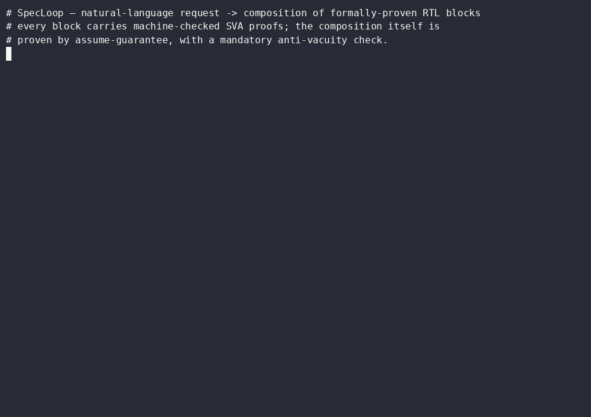
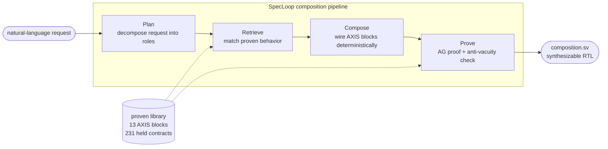

# SpecLoop

## Video overview

This one-minute video explains what SpecLoop is, why it starts from formally verified RTL, and how it turns a natural-language request into a proven, synthesizable hardware design.


## Product demo

The demo below shows the end-to-end flow: SpecLoop plans a design, retrieves proven hardware blocks, composes them, and formally verifies the result.



SpecLoop is an experiment in generating hardware from RTL that has already been formally verified.

Give it a natural-language hardware request and it finds matching proven blocks, connects them into a synthesizable design, and checks the resulting composition with formal verification.

The idea I wanted to test was simple: **if AI is going to generate RTL, can some of the verification work come with the generated design instead of starting from zero afterward?**

## Example

```bash
python -m specloop.compose.e2e \
  "register, buffer, normalize frame length, and rate-limit an 8-bit stream"
```

SpecLoop turns that request into:

```text
register
  -> buffer
  -> frame length adjust
  -> rate limiter

axis_pipeline_register
  -> axis_fifo
  -> axis_frame_length_adjust
  -> axis_rate_limit

composition proof  : PASS
corrupted reference: FAIL
output              : work/composition.sv
```

For this demo, SpecLoop selects four AXI-Stream blocks from the proven library, generates a synthesizable top module, and proves reset and back-pressure properties across the composition.

It also deliberately corrupts a reference assertion and reruns the proof. If the corrupted version does not fail, the original PASS is not trusted.

## What currently works

- 13 single-clock AXI-Stream modules re-proven under a non-vacuous formal harness
- 267 LLM-generated assertions audited
- 231 assertions shown to hold
- 32 incorrect assertions exposed by real counterexamples
- natural-language planning constrained to the proven catalog
- retrieval based on behavior derived from proven contracts
- synthesizable four-stage RTL composition
- assume-guarantee proof for the included four-stage composition
- deterministic test suites with live SymbiYosys proof runs

## Why I built it

SpecLoop started while I was taking digital design and trying to understand RTL that was difficult to reason about from code alone.

The first version was much simpler: use an LLM to turn RTL into a natural-language explanation. From there I became more interested in the broader problem of shortening the chip-design cycle, especially the relationship between RTL generation and verification.

A lot of AI hardware work treats those as separate steps: generate RTL first, then verify it. SpecLoop was my attempt to see what happens if generation starts from hardware whose behavior is already known and formally checked.

The intended flow became:

```text
natural-language request
        |
        v
find proven RTL blocks
        |
        v
compose a new design
        |
        v
formally verify the composition
        |
        v
synthesizable RTL
```

## The soundness problem

The most important part of the project came from discovering that the original proof pipeline was wrong.

The first implementation generated SystemVerilog Assertions for each module, attached them with `bind`, and ran SymbiYosys/Yosys. The system built a library of apparently proven modules and eventually produced a four-stage AXI-Stream composition reporting **95 carried + 14 interaction assertions, PASS, confidence 1.0, in about a second**.

That result looked too good.

So I ran a simple check: attach `assert(1'b0)` — an assertion that is always false — through `bind` and run the proof.

It passed.

Inlining the exact same false assertion into the module body failed immediately.

The Yosys `read_verilog` frontend used in that flow was parsing the `bind` statement without warning but never instantiating the bound assertion module. The proof engine was therefore proving an empty property set. The original library was not actually verified.

Two related issues showed up during the same audit:

- zero-assertion runs were being counted as `pass@1.00`; they now report `unknown@0.00`
- `synlig` correctly honored `bind`, but hit internal errors on the composition RTL and could not simply replace the existing frontend

### Rebuilding the proof harness

I threw out the old proof results and re-proved the library from scratch with a harness designed to make vacuous success harder to hide.

The rebuilt harness uses:

- **Inline assertions instead of `bind`.** Assertion bodies are injected into a copy of the RTL source so they must reach the netlist.
- **Driven reset sequencing.** Reset is explicitly exercised before normal operation so `$past` behavior is well-defined.
- **AXI-Stream source assumptions.** Inputs follow basic AXIS source behavior while output-side behavior remains free to prove.
- **Three anti-vacuity checks.** A result is not accepted unless all three behave correctly:
  1. `assume_sat`: `assert(1'b0)` must fail under the environment assumptions
  2. `cover`: a normal accepted transaction must be reachable
  3. `assert_chk`: corrupting one stored assertion must make the proof fail

The rebuilt run processed **267 generated assertions across 13 AXI-Stream modules**:

- **231 held**
- **32 were wrong and produced real counterexamples**
- **4 were reclassified as assumptions rather than assertions**

The `bind` behavior is now a regression test. The project also follows a simple rule: **no PASS is trusted until the same harness has demonstrated that it can FAIL.**

## What is proven today

Everything below is reproducible from this repository with `scripts/setup.sh`.

### 1. Proven module library

13 single-clock AXI-Stream modules were re-proven under the rebuilt harness using RTL from [alexforencich/verilog-axis](https://github.com/alexforencich/verilog-axis).

| module | held / total assertions | sound confidence |
|---|---:|---:|
| `axis_pipeline_register` | 16/16 | 1.00 |
| `axis_srl_register` | 13/13 | 1.00 |
| `axis_register` | 24/25 | 0.96 |
| `axis_fifo` (DEPTH=256) | 24/25 | 0.96 |
| `axis_frame_join` | 18/19 | 0.95 |
| `axis_adapter` | 10/11 | 0.91 |
| `axis_cobs_decode` | 23/26 | 0.88 |
| `axis_cobs_encode` | 17/20 | 0.85 |
| `axis_rate_limit` | 29/35 | 0.83 |
| `axis_mux` | 12/15 | 0.80 |
| `axis_srl_fifo` | 14/19 | 0.74 |
| `axis_frame_length_adjust` | 14/19 | 0.74 |
| `axis_demux` | 17/24 | 0.71 |

Two additional modules were left out rather than force-fit into the harness:

- `axis_async_fifo` — dual-clock; needs a CDC-aware environment
- `axis_ll_bridge` — generated spec does not elaborate correctly

### 2. Four-stage assume-guarantee proof

For:

```text
axis_pipeline_register
    -> axis_fifo
    -> axis_frame_length_adjust
    -> axis_rate_limit
```

SpecLoop proves seven cross-boundary properties covering reset behavior, back-pressure data stability, and valid-hold behavior under stall.

The proof uses contract stubs: each block is replaced by unconstrained outputs limited only by guarantees that were already proven for that block. Five of the seven composition properties followed from the existing contracts; two exposed missing contract properties that had to be proved first.

Corrupting the reference assertion changes the result to FAIL.

### 3. End-to-end data-integrity proof

For:

```text
axis_cobs_encode -> axis_register -> axis_cobs_decode
```

A bounded model checking harness injects a symbolic frame and checks byte-exact round-trip delivery with a completion deadline.

This is proven for all frames up to 8 bytes. The claim is deliberately bounded; it is not presented as an unbounded proof.

### 4. Natural-language -> proven composition pipeline

The end-to-end command performs:

```text
plan -> retrieve -> compose -> prove
```

Requests are constrained to the proven catalog. Unsupported functions, unsupported widths, missing blocks, and missing proof artifacts fail explicitly rather than silently substituting something else.

Retrieval is based on behavioral signatures derived from proven contracts rather than hand-assigned function labels. The test suite checks this by scrambling stored labels and confirming retrieval behavior does not change.

## Architecture


```mermaid
flowchart LR
    REQ(["natural-language request"]) --> P
    subgraph E2E["SpecLoop composition pipeline"]
        direction LR
        P["Plan<br/>decompose request into roles"]
        R["Retrieve<br/>match proven behavior"]
        C["Compose<br/>wire AXIS blocks deterministically"]
        V["Prove<br/>AG proof + anti-vacuity check"]
        P --> R
        R --> C
        C --> V
    end
    LIB[("proven library<br/>13 AXIS blocks<br/>231 held contracts")] -.-> R
    LIB -.-> V
    V --> OUT(["composition.sv<br/>synthesizable RTL"])
```

Under the composition layer is the per-module spec pipeline:

```text
RTL
 -> parse with pyslang
 -> generate categorized SVA
 -> prove with SymbiYosys
 -> inspect counterexamples
 -> store proven behavior
```

The configured LLM can be Anthropic, local vLLM, or Ollama. Qdrant-based semantic search still exists as an optional path, but embedding-only retrieval was moved out of the trusted composition path.

Main code locations:

```text
src/specloop/{ir,gen,formal,loop}   per-module spec pipeline
src/specloop/compose                planning, retrieval, composition, AG proof
work/                               proof artifacts
work/recheck_axis/                  rebuilt proof harness and results
```

## Quickstart

Requirements:

- Linux x64
- Python >= 3.11
- roughly 6 GB of disk space
- Anthropic API key only for the live planning stage

```bash
git clone https://github.com/hrisheekmust-blip/SPECLOOP.git specloop
cd specloop

bash scripts/setup.sh
source .venv/bin/activate
export PATH="$PWD/oss-cad-suite/bin:$PATH"
export ANTHROPIC_API_KEY=...

python -m specloop.compose.e2e \
  "register, buffer, normalize frame length, and rate-limit an 8-bit stream"
```

The setup script pins the formal toolchain to **OSS CAD Suite 2025-01-14 (Yosys 0.48+77, git eac2294ca)**. Exact Python dependency versions are in `requirements.lock.txt`.

The deterministic test suites run without an API key:

```text
tests/test_improvements.py  22/22
tests/test_retrieval.py     16/16
tests/test_planner.py       13/13
```

## Limits

The current project has real limits:

- the assume-guarantee harness is implemented for the included Chain A composition rather than arbitrary new chains
- Chain A does not yet prove full end-to-end data conservation
- the proven catalog is uniformly 8-bit
- `axis_async_fifo` requires a proper multi-clock environment
- arbitrary proof-harness generation was not completed

## Project status

SpecLoop reached a sound end-to-end milestone and I stopped development there rather than continuing to add features on top of unresolved research questions.

The repo remains reproducible and documents both what worked and what did not. See [POSTMORTEM.md](POSTMORTEM.md) for the full write-up and [DESIGN.md](DESIGN.md) for unimplemented directions such as assertion-centric retrieval, subsumption checking, and PPA-aware search.
